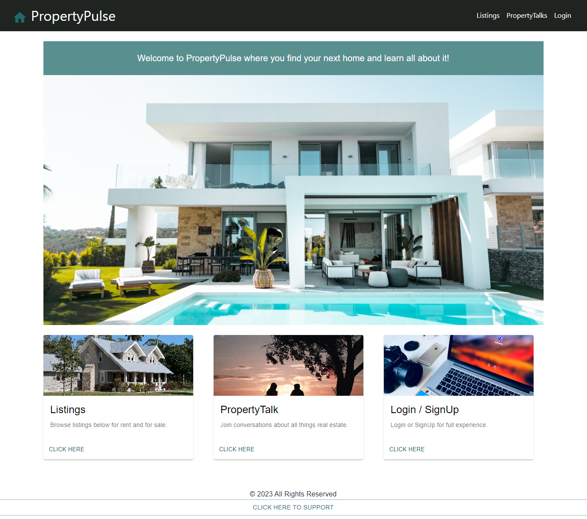

# Real Estate App


## Table of Contents

- [Description](#description)
- [Installation](#installation)
- [Usage](#usage)
- [Contributions](#contributions)
- [License](#license)

## Description
-  Real estate application that allows users to browse real estate listings that are for sale or rent within any zip code within the United States. User will be able to comment on the listings and share their thoughts and opinions on the property. The app will also have a forum for people to engage and discuss all things real estate such as area quality, open house announcements, searching for a roommate, or just sharing your thoughts on the current real estate climate.

- Technologies used: MongoDB/Mogoose ODM, Express.js, React, Node.js with GraphQL. For styling, used Material UI and React Bootstrap for select components.

## Installation

To install necessary dependencies, run the following command:

```npm i```

## Usage

- The link to the deployed application: https://radiant-bayou-10994-4d4c2b2a5c96.herokuapp.com/

- User is able to browse for Rent and for Sale listings by navigating to Listings tab. 

- User can leave comments on the individual listings when user is logged in. 

- User can navigate to PropertyTalks to start a new topic and join other conversations about real estate (user needs to be logged in to start or join discussion). 

- Users can donate to support by clicking "CLICK HERE TO SUPPORT" in the footer section.

 


## Contributions

- Oliver Nasevski. 
  Contact Info: oliver.nasevski@gmail.com 
  GitHub: https://github.com/oliver23n

- Darvin Marte. 
  Contact Info: darvinmarte13@gmail.com 
  GitHub: https://github.com/darvinmarte

- Vlada Caban. 
  Contact Info: veliseeva.ny@gmail.com
  GitHub: https://github.com/vlada-caban

- Aimee Darling. 
  Contact Info: aimee.darling@gmail.com
  GitHub: https://github.com/aimeedarling

## Questions

Any questions, please feel free to contact any of the contributors listed above. 

## License

 This application was licensed under MIT license.